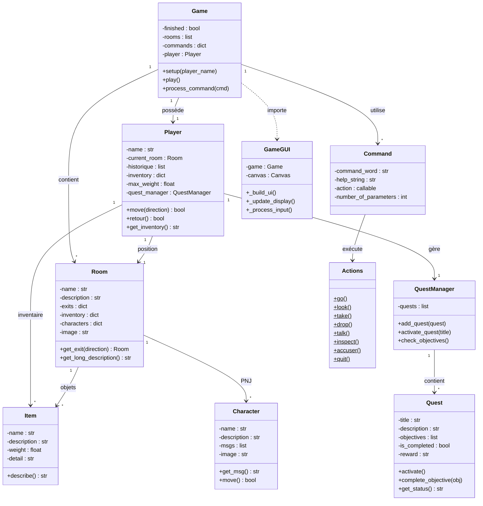

# 🔍 Mystère au Manoir - Jeu d'Aventure Textuel

Un jeu d'aventure textuel de type enquête où vous incarnez un détective chargé de résoudre un meurtre mystérieux dans un manoir victorien.

## 🎬 Vidéo de présentation

[](https://youtu.be/DnHG0lnyS1s)

👉 **[Voir la vidéo de présentation du jeu](https://youtu.be/DnHG0lnyS1s)**

---

## 📖 Table des matières

1. [Guide Utilisateur](#-guide-utilisateur)
   - [Installation](#installation)
   - [Comment lancer le jeu](#comment-lancer-le-jeu)
   - [L'univers du jeu](#lunivers-du-jeu)
   - [Commandes disponibles](#commandes-disponibles)
   - [Les quêtes](#les-quêtes)
   - [Conditions de victoire/défaite](#conditions-de-victoiredéfaite)
2. [Guide Développeur](#-guide-développeur)
   - [Structure du projet](#structure-du-projet)
   - [Diagramme de classes](#diagramme-de-classes)
   - [Description des modules](#description-des-modules)
3. [Perspectives de développement](#-perspectives-de-développement)

---

## 👤 Guide Utilisateur

### Installation

1. **Prérequis** : Python 3.8 ou supérieur
2. **Cloner le dépôt** :
   ```bash
   git clone <url-du-repo>
   cd TBA
   ```
3. **Dépendances optionnelles** (pour l'interface graphique) :
   ```bash
   pip install pillow
   ```
   > Note : Le jeu fonctionne en mode texte sans dépendances supplémentaires. Tkinter est inclus dans Python par défaut.

### Comment lancer le jeu

```bash
python game.py
```

Le jeu détecte automatiquement si l'interface graphique (Tkinter) est disponible :
- **Si Tkinter est disponible** → Lance l'interface graphique
- **Si Tkinter n'est pas disponible** → Lance le mode console (texte)

**Forcer le mode console** :
```bash
python game.py --cli
```

### L'univers du jeu

Vous êtes un détective appelé dans un **manoir victorien** suite à un meurtre mystérieux. Le corps d'**Armand**, le maître des lieux, a été découvert dans son bureau, entouré de sang et de papiers éparpillés.

#### Les lieux du manoir

Le manoir comprend **11 pièces** à explorer :

| Pièce | Description |
|-------|-------------|
| 🏛️ **Hall** | Entrée principale avec un grand lustre et une horloge arrêtée à 22h30 |
| 🌿 **Jardin d'hiver** | Plantes exotiques sous une vitre brisée |
| 🛋️ **Salon victorien** | Fauteuils usés et cheminée froide |
| 🍲 **Cuisine** | Chaudron fumant et couteaux alignés (un manque) |
| 📝 **Bureau** | Scène du crime - corps de la victime |
| 🚪 **Couloir** | Long couloir sombre avec traces de pas |
| 🛏️ **Chambre** | Lit défait et fenêtre entrouverte |
| 📖 **Bibliothèque** | Rayonnages de livres anciens |
| 🕯️ **Pièce cachée** | Pièce secrète avec des parchemins |
| 🍷 **Cave à vin** | Cave fraîche remplie de bouteilles anciennes |
| 🛠️ **Atelier** | Outils et plans éparpillés |

#### Les suspects

Cinq personnages sont présents dans le manoir et peuvent être interrogés :

- **Émile** - Le jardinier, employé du manoir
- **Clara Beaumont** - Invitée, lectrice reconnue
- **Victor Lenoir** - Ingénieur, invité de l'atelier
- **Hélène de Valenbourg** - Épouse de la victime
- **Maurice Delcourt** - Archiviste, visiteur studieux

### Commandes disponibles

#### Navigation

| Commande | Description |
|----------|-------------|
| `go <direction>` | Se déplacer (N/Nord, S/Sud, E/Est, O/Ouest, U/Haut, D/Bas) |
| `back` | Revenir à la pièce précédente |
| `history` | Afficher l'historique des déplacements |
| `look` | Regarder la pièce actuelle |

#### Interactions avec les objets

| Commande | Description |
|----------|-------------|
| `take <objet>` | Ramasser un objet |
| `drop <objet>` | Déposer un objet |
| `check` | Afficher l'inventaire |
| `inspect <objet>` | Examiner un objet en détail (nécessite une loupe) |
| `unlock <objet>` | Déverrouiller un objet avec une clé |

#### Interactions avec les personnages

| Commande | Description |
|----------|-------------|
| `talk <personnage>` | Parler à un personnage présent |
| `accuser <suspect>` | ⚖️ **Accuser un suspect du meurtre** (commande finale) |

#### Quêtes et système

| Commande | Description |
|----------|-------------|
| `quests` | Afficher la liste des quêtes |
| `quest <titre>` | Afficher les détails d'une quête |
| `activate <titre>` | Activer une quête |
| `rewards` | Afficher vos récompenses |
| `help` | Afficher l'aide |
| `quit` | Quitter le jeu |

#### Raccourcis clavier (mode graphique)

- **Flèches directionnelles** : Navigation (↑↓←→)
- **U** : Monter
- **D** : Descendre
- **B** : Revenir en arrière
- **Escape** : Quitter

### Les quêtes

Le jeu propose plusieurs quêtes à accomplir :

1. **Explorateur du Manoir** - Visitez les pièces principales
2. **Grand Voyageur** - Déplacez-vous 10 fois
3. **Découvreur de Secrets** - Trouvez les lieux cachés
4. **Rencontres Mystérieuses** - Interrogez tous les suspects
5. **Le Livre Étrange** - Trouvez le mystérieux livre

### Conditions de victoire/défaite

- **🏆 Victoire** : Utilisez la commande `accuser <suspect>` pour accuser le bon coupable. Rassemblez les indices (lettres, testament, objets) et interrogez les suspects pour découvrir qui est le meurtrier !
- **💀 Défaite** : Si vous accusez le mauvais suspect, le vrai coupable s'échappe et l'enquête échoue.

> 💡 **Conseil** : Explorez chaque pièce, examinez les objets avec `inspect`, et parlez à tous les personnages avant de faire votre accusation !

---

## 💻 Guide Développeur

### Structure du projet

```
TBA/
├── game.py          # Classe principale du jeu
├── player.py        # Gestion du joueur
├── room.py          # Modèle des pièces
├── item.py          # Modèle des objets
├── character.py     # Modèle des personnages (PNJ)
├── command.py       # Gestion des commandes
├── actions.py       # Actions exécutables
├── quest.py         # Système de quêtes
├── interface.py     # Interface graphique Tkinter
├── README.md        # Documentation
└── assets/          # Images et ressources graphiques
    ├── bg_*.png     # Images de fond des pièces
    ├── npc_*.png    # Sprites des personnages
    └── splash_intro.png
```

### Diagramme de classes



### Description des modules

| Module | Classe | Responsabilité |
|--------|--------|----------------|
| `game.py` | `Game` | **Point d'entrée** : création du monde, gestion des commandes, boucle de jeu. Lance automatiquement l'interface graphique ou le mode console. |
| `player.py` | `Player` | Représentation du joueur : position, inventaire, historique, quêtes |
| `room.py` | `Room` | Modèle de pièce : description, sorties, objets, personnages présents |
| `item.py` | `Item` | Objets ramassables : nom, description, poids, détails d'inspection |
| `character.py` | `Character` | Personnages non joueurs : dialogues, déplacements aléatoires |
| `command.py` | `Command` | Structure d'une commande : mot-clé, aide, action associée |
| `actions.py` | `Actions` | Méthodes statiques pour toutes les actions du jeu |
| `quest.py` | `Quest`, `QuestManager` | Système de quêtes : objectifs, progression, récompenses |
| `interface.py` | `GameGUI` | Interface graphique Tkinter (importée par `game.py` si disponible) |

---

## 🚀 Perspectives de développement

### Améliorations envisagées

1. **Système de combat/confrontation**
   - Ajouter des mécaniques de confrontation avec le coupable
   - Système d'accusation formelle avec vérification des preuves

2. **Indices et déductions**
   - Carnet d'enquêteur pour noter les indices découverts
   - Système de déduction permettant de relier les preuves

3. **Scénarios multiples**
   - Plusieurs coupables possibles selon les parties
   - Fins alternatives basées sur les choix du joueur

4. **Amélioration de l'interface graphique**
   - Animations pour les déplacements
   - Effets sonores d'ambiance
   - Mini-carte du manoir

5. **Système de sauvegarde**
   - Sauvegarde/chargement de partie
   - Sauvegarde automatique

6. **Enrichissement narratif**
   - Plus de dialogues avec les PNJ
   - Événements aléatoires pendant l'enquête
   - Cutscenes pour les moments clés

7. **Accessibilité**
   - Support de différentes langues
   - Mode daltonien pour l'interface graphique
   - Lecteur d'écran compatible

---

## 📝 Auteurs

Projet réalisé dans le cadre d'un cours d'informatique.

- **Alessandro Di Gallo Clauss**
- **Laure Dauthieu**
